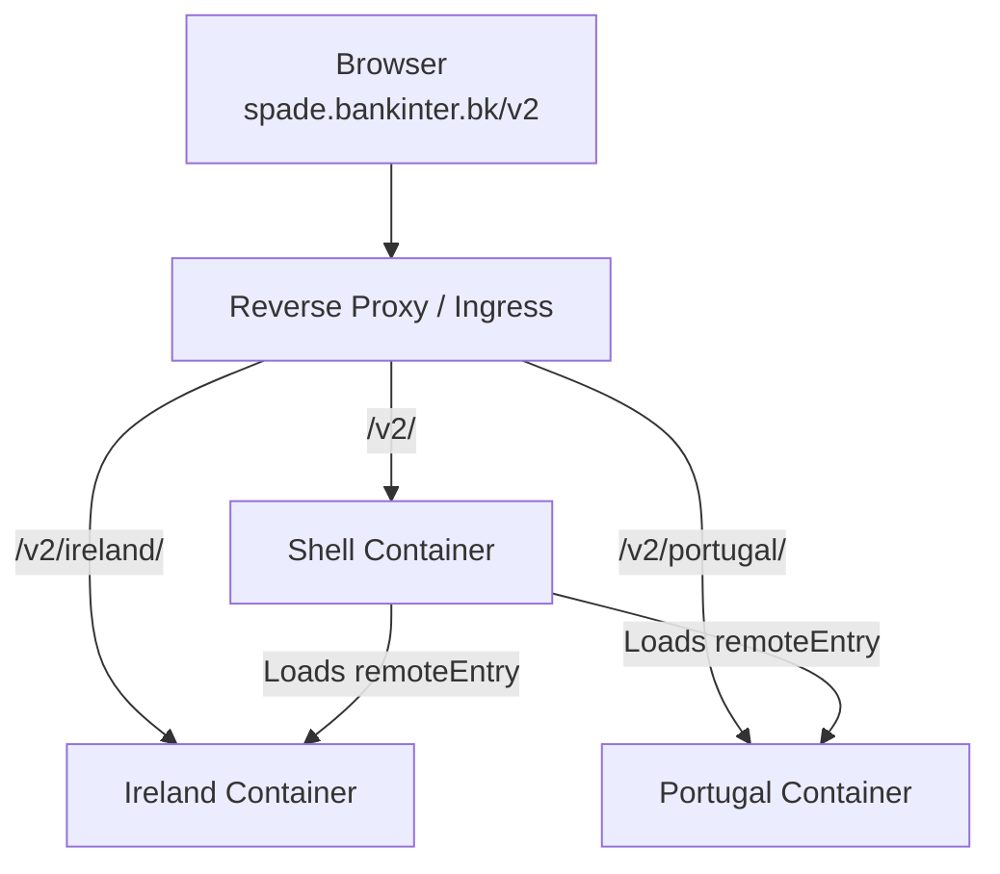

# 📦 Service Booster V2 – Contrato de Publicación (Microfrontends)

---

## 1️⃣ Arquitectura general

La solución V2 está compuesta por contenedores independientes:

- Shell
- Remote Ireland
- Remote Portugal

Cada uno se publica como imagen Docker independiente y puede desplegarse sin afectar al resto.

El enrutado se realiza por path bajo el mismo dominio.

---

# 🌐 2️⃣ Rutas oficiales en Producción

Dominio base:

```
https://spade.bankinter.bk
```

## Shell

Ruta:

```
/v2/
```

Ejemplo:

```
https://spade.bankinter.bk/v2/?mf=all
```

---

## Remote Ireland

Ruta:

```
/v2/ireland/
```

Archivo crítico:

```
/v2/ireland/remoteEntry.mjs
```

---

## Remote Portugal

Ruta:

```
/v2/portugal/
```

Archivo crítico:

```
/v2/portugal/remoteEntry.mjs
```

---

# 🔁 3️⃣ Reglas de Reverse Proxy / Ingress

⚠ IMPORTANTE: No realizar reescritura (strip-prefix) de las rutas.

Las rutas deben preservarse completas.

## Reglas necesarias

| Path | Backend |
|------|---------|
| /v2/ | Servicio Shell |
| /v2/ireland/ | Servicio Ireland |
| /v2/portugal/ | Servicio Portugal |

### No debe hacerse:

- Rewrite de `/v2/ireland` → `/`
- Strip prefix
- Modificación de rutas internas

La aplicación está construida con `baseHref` y `deployUrl` explícitos.

---

# 🧪 4️⃣ Validaciones obligatorias tras despliegue

## Shell

```
GET /v2/ → 200
```

## Ireland

```
GET /v2/ireland/remoteEntry.mjs → 200
```

## Portugal

```
GET /v2/portugal/remoteEntry.mjs → 200
```

---

# 🧠 5️⃣ Funcionamiento interno (Module Federation)

El Shell carga dinámicamente los remotes mediante el siguiente manifest:

```
/v2/assets/module-federation.manifest.prod.json
```

Contenido esperado:

```json
{
  "ireland": "/v2/ireland/remoteEntry.mjs",
  "portugal": "/v2/portugal/remoteEntry.mjs"
}
```

Si las rutas cambian en infraestructura, deberá actualizarse este manifest.

---

# 🔄 6️⃣ Independencia de despliegue

| Cambio | Requiere redeploy |
|--------|------------------|
| Solo Ireland | Solo contenedor Ireland |
| Solo Portugal | Solo contenedor Portugal |
| Solo Shell | Solo contenedor Shell |

No es necesario reconstruir el resto.

---

# 📦 7️⃣ Versionado recomendado

```
sb-shell:2.0.0
mf-ireland:2.0.5
mf-portugal:2.0.3
```

El despliegue debe permitir actualizar versiones individualmente.

---

# 🧩 8️⃣ Configuración SPA (Fallback obligatorio)

Cada servicio debe incluir fallback SPA:

Ejemplo nginx:

```nginx
try_files $uri $uri/ /v2/index.html;
```

(o equivalente según subruta)

---

# 🔐 9️⃣ CORS

No se requieren configuraciones CORS adicionales al estar bajo el mismo dominio.

---

# ✅ 10️⃣ Resultado esperado

Accediendo a:

```
https://spade.bankinter.bk/v2/?mf=all
```

Debe:

- Cargar el Shell
- Cargar Ireland y Portugal dinámicamente
- No producir errores 404
- No intentar acceder a localhost
- Permitir despliegue independiente de cada microfrontend

---

# 🧭 Diagrama de Arquitectura

## Vista Simplificada (ASCII)

```
                        ┌─────────────────────────────┐
                        │  spade.bankinter.bk         │
                        └───────────────┬─────────────┘
                                        │
                                Reverse Proxy / Ingress
                                        │
        ┌───────────────────────────────┼───────────────────────────────┐
        │                               │                               │
   /v2/ (Shell)                 /v2/ireland/                    /v2/portugal/
        │                               │                               │
   sb-shell container            mf-ireland container            mf-portugal container
        │                               │                               │
   index.html                      remoteEntry.mjs                remoteEntry.mjs
        │
   Carga dinámica de remotes vía Module Federation
```

---

## Diagrama Mermaid (si la plataforma lo soporta)



---

# 🏁 Conclusión

La arquitectura permite:

- Despliegues independientes por microfrontend
- Escalado independiente
- Evolución progresiva sin impactar al legacy
- Separación clara entre infraestructura y aplicación